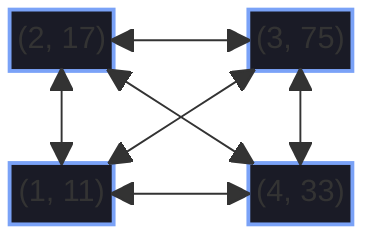
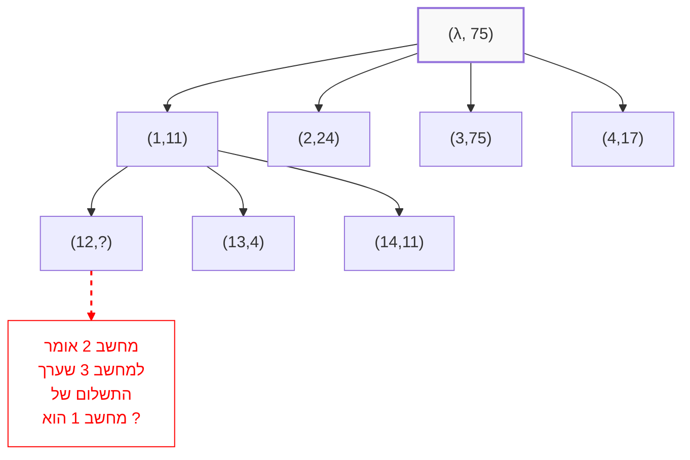

to continue the previous lecture,
we talked about the coordinated attack problem and proved that there is no algorithm that promises a solution to the problem within a finite amount of steps.

## server failure 

-  **nice failure** :
	Every computer that falls, always falls *before* or *after* sending a message - there can't be a state where a computer didn't send to all neighbors he wanted to send to.
		
- **stopping failure** :
	in contrast to nice failures, there might be a state where there is a chance for a successful message for some neighbors and unsuccessful to others.
	
- **byzantine failure**:
	computer is behaving in an unexpected manner and might send an incorrect message on purpose (lying...).

# The agreement/consensus problem

- We assume that the network is a clique of size **N**.
- The max. amount of failures is known beforehand.
- Every computer know a default value of some sort that is known beforehand.
- Every computer initializes with a certain value.

**Conditions** : 
1. agreement - no 2 computers decide on different values.
2. Attack-abillity - if all have the same value they must agree on it.
3. all unfallen computers must decide the outcome.

**Definition** : Byzantine failures 

1. No 2 computers that have not failed, decide on the outcome
2. If both computer that didn't fail decide on the same value then their input must be the same.
3. All non-failing computers must decide the outcome.

The algorithms that we will build must be of min. time complexity meaning...
- Fewest messages as possible.
- Fewest stages/rounds as possible.

**Nice failures solution :**
- Every one of them sends their input to every body : $\mathcal{O}(N^2)$ 
- Every computer decides on minimal value that it sees.

**Stopping failures solution :**
- Since we know that there are at most $\mathbf{f}$ failures, we will
	1. Every computer will work for  $\mathbf{f + 1}$  rounds. every stage a computer sends new information that he learnt from previous stage.
		that promises that there will definitely be a stage without failures (by the pigeon hole principle)
	2. Therefore in that stage all computers will sync and they will be active to sync regarding their mutual information.
	3. After $\mathbf{f+1}$ stages the computer decides on the minimal value that it has seen.
	
- Number of stages  : $\mathcal{O}((F+1)\cdot N^2)$ 
- Number of messages : $\mathcal{O}((F+1)\cdot N^2)$ 

**How tackle the problem when f is not known?**

	hint : if a computer gets in 2 consequtive stages the same information that could help decide the outcome.

**Byzantine failures** :

	Exponential Information backing 

![[Pasted image 20260423103144.png]]

- $\mathbf{f<\frac{\mathbf{N}}{3}}$ 

- Every computer saves the information that he gets from the rest  of the computers in a special data-structure called **EIG tree**

- Every node in the tree has 2 values :
	1. $\lambda$ - Denotes ID , a child node's ID has the parent node's ID as a prefix follows by another number not previously used.
	2. Value - starts with a default value of some sort based on a known protocol.
	
![[Pasted image 20260423103631.png]]

- within every stage, a node computer shares correspondence with other computers.
	1. for example if we look at node 3 while node 2 is a liar, we can see that firstly, 3 shares that 
		- node 1 gave it the information of the value 11.
		- node 2 gave it the information of the value 24.
		- node 3 already knew its own default value, 75.
		- node 4 gave it the information of the value 75.
	2. we can examine the process of node 1's EIG tree building :
		- node 2 gave it the information 
		- of the value 11
		- and the node ID is set to be 12
		- meaning that 2 was given previously by 1 the value that 3 gave him which is  11.
	3. this process proceeds until we either finally find the culprit ignore their input and choose receiving information from all the rest instead , Or , choose the 
		

![[Pasted image 20260423104716.png]]

1. computer i sends val($\lambda$) to all other computers and if the message contains the value v to computer i from computer j then we set : _val(j) = v_ and if no message doesn't arrive from j then we set it to _null_.

2. 2<k<f+1 : computer i sends all

