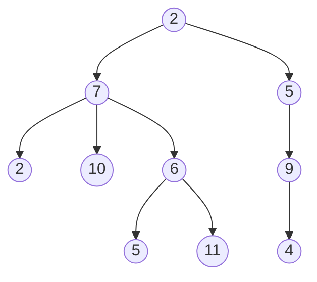
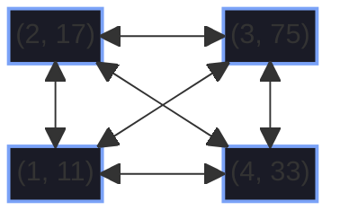
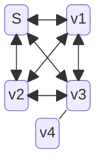

#### graph example using mermaid






#### code block in c

```
#include stdio;
#define NUM_STAGES 6;

void main{
int i = 0 ;

	for( i=0 ; i<NUM_STAGES ; i++){
		if (i%3 == 0){
			printf("multiple of 3!")
		}
	}
}
```

