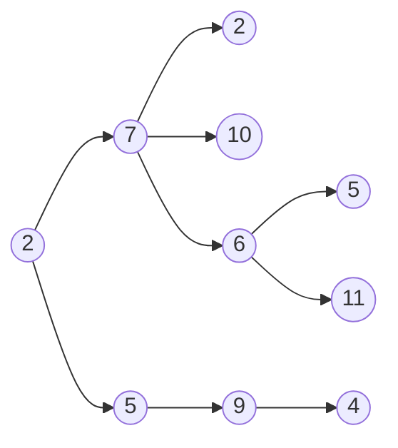
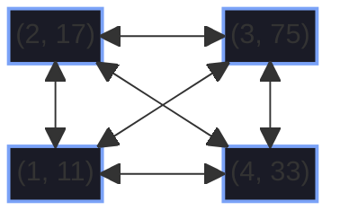
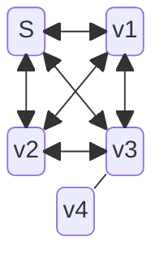

#### graph example using mermaid






#### code block in c

```
#include stdio;
#define NUM_STAGES 6;

void main{
int i = 0 ;

	for( i=0 ; i<NUM_STAGES ; i++){
		if (i%3 == 0){
			printf("multiple of 3!")
		}
	}
}
```

>[!info]
>[[lecture 5#Building the _ELG_ tree]]


## Story time... (By eyal the _Gay_)

>[!note]-
>You basic bitch!

>[!success]- 
>I live still!
>>[!check]- 
>>I am alive, I'm not lying...

>[!warning]-
>Life is getting hard, be warned.

>[!caution]-
>Hey!
>There's a pit there!

>[!fail]-
>In life mostly...

>[!missing]-
>A life.
>>[!note]-
>>Haha
>>Missing a life while not having it - A PARADOX. WOW

>[!example]-
>Example for what?
>I know literally nothing

>[!question]-
>What is the meaning of life?

>[!help]-
>Im stuck in a pit :(
>A fucking pit would you believe it?
>You would think there would be a warning or a caution sign...

>[!quote]-
>"It's a dangerous business, Frodo, going out your door, if you don't keep your feet there is not knowing where you might be sept of too." -Billbo Baggins-
>>[!cite]-
>>Lord of the Rings
>
>>[!note]-
>>Its a nice quote you know, adventures and stuff.
>>pretty fun...

>[!info]-
>For youtrinformation, there was a pit there, just so you know...

>[!abstract]-
>My whole life is one big abstract.

>[!todo]-
>1. Get a life.
>2. Do something with it.

>[!tip]-
>Be careful of pits.
>And look at signs, they are there mostly.

>[!bug]-
>Sometimes there are no signs and you just have to look WITH YOUR FUCKING EYES!!!