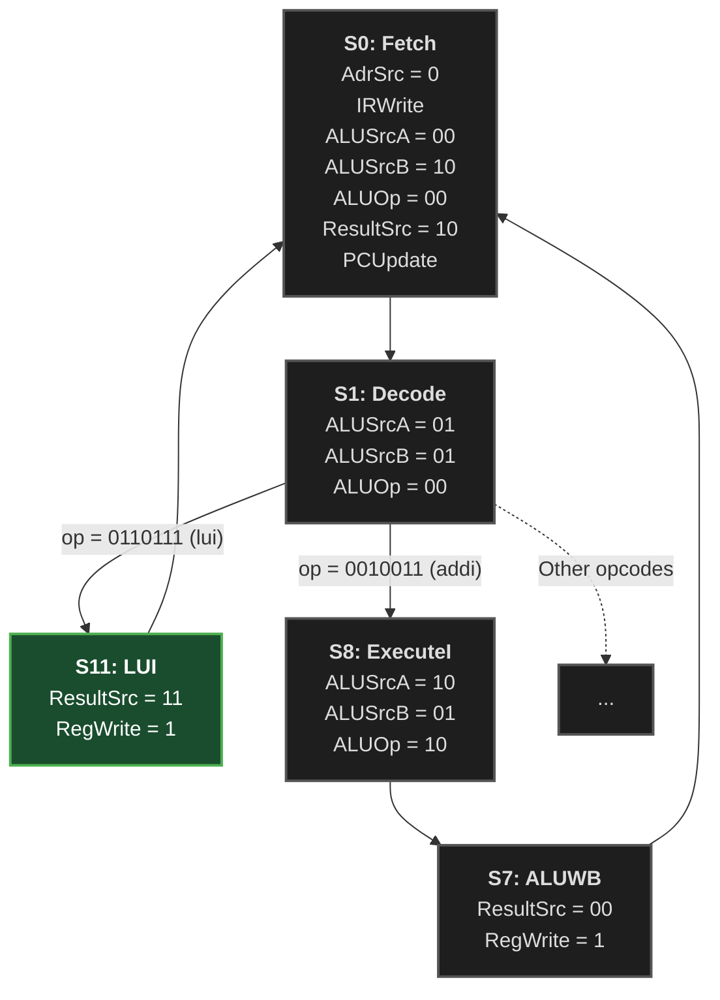

## Question 1

![[Pasted image 20260611232624.png]]

### a) `addi` instruction support
![[Pasted image 20260611232715.png]]
Yes, the instruction is supported. We will walk through the entire path of the instruction in the given FSM and show that it is being executed correctly within all states.

1. **Fetch (S0) :**
	performed on all instructions regardless of if they are being supported or not.
	
2. **Decode (S1):**
	`addi`'s opcode is : `0010011` as shown in the  [[Correction_DDCA-RISC-V page.pdf|ISA summary table]] (given as course material) ![[Pasted image 20260611233421.png]]
	We can see that in the decoding state, the instruction is being routed to the state matching the opcode of the instruction in the FSM. ![[Pasted image 20260611235253.png]]
	The `addi` instruction is a CI-type instruction so it makes sense that it takes that route.
	
3. **ExecuteI (S8) :**
	The instruction is being executed in the ALU.
	
4. **ALUWB (S7) :**
	Writing the computed value of the instruction to the destination register.

> [!success] Supported!
> Since the instruction has a designated route inside the FSM that matches its opcode we can be sure that it is supported. 
> Instruction path : $S_{0} \to S_{1} \to S_{8} \to S_{7}$

### b) Adding support for `lui` 
![[Pasted image 20260612001201.png]]

We want our FSM to support the `lui` instruction.
![[Pasted image 20260612001436.png]]
We notice that the opcode `0110111` is not routed to any state from the **decode** state which shows that the instruction is indeed unsupported.

To achieve that we want the **decode** state to route the instruction to a new state that handles the logic of the instruction correctly and then route it from that state to **ALUWB (S7)**.

- We will add a new state  **S11 : LUI** to handle the instruction. 
- We will set the **Decode** state to route the opcode `010111` to the new state.
- Since the `lui` instruction is to load the  upper immediate value `upimm` to a destination register `rd`.
-  We need send a control signal for sending `upimm` from the sign extension unit (`11`) to the register file so the state will contain : `ResultSrc = 11` 
-  We need send a control signal to the register file to write to `rd` so the state will contain : `RegWrite = 1`
- The new state will route the user back to **S0 : Fetch** after finishing executing the instruction.

The following diagram shows the implementation supporting `lui` by adding **S11 : LUI** :



### c) Missing `ImmSrc` signal
![[Pasted image 20260612010601.png]]

The `ImmSrc` control signal is not mentioned in any of the states in the given FSM since the logic that it handles is encapsulated in the `ImmGen`(immediate generator) unit.
The `ImmSrc` is an internal signal inside the `ImmGen` unit. The only connection the `ImmGen` unit has to the rest of the system is checking if the instruction type is an `I-type` and the rest is handled within the unit so the FSM has use for the `ImmSrc` signal.

### d) `ALUsrcA` in different states
![[Pasted image 20260613143326.png]]

The main reason for the change in the value of the control signal `ALUsrcA` between the states is the changing role of register A in every different state.

1. **S0 : Fetch**
	In this state, the CPU is advancing the `PC` address to the next one.
	For that purpose, the CPU uses `regA` to store the value of the `PC` from the previous `MUX` and `regB` to store the constant value 4 from the previous `MUX`. 
	This means that `regA` is used to store the content of the `PC` and for that we use the control signal `ALUsrcA = 00`.

2. **S1 : Decode**
	In this state, the CPU is pre-calculating a potential branch target address.
	For that purpose the CPU uses `regA` to store the value of the `OldPc` (from previous cycle...) while `regB` is used to store the sign extension of the immediate value `ImmExt`.
	This means that `regA` is used to store the content of the `OldPc` that is delayed for one cycle and for that we use the control signal `ALUsrcA = 01`

3. **S8 : ExecuteI**
	In this state, the CPU is calculating the result of an `I-type` instruction.
	For that purpose the CPU uses `regA`  first operand and `regB` to store the sign extended immediate as the second operand.
	This means that `regA` is used to store the content of a register from the register file and for that we use the control signal `ALUsrcA = 10`.

![[Pasted image 20260613154546.png]]

## Question 2 
![[Pasted image 20260613154726.png]]
[link to simulator](https://webriscv.altervista.org/)
### Simulator Workflow
![[Pasted image 20260613155214.png]]

### a) No Forwarding
![[Pasted image 20260613155311.png]]

After running the given code with the requested setup with `Forwarding : Deactivated`  we can count 10 clock cycles.
![[Pasted image 20260613163352.png]]

### b) With Forwarding
![[Pasted image 20260613155618.png]]

After running the given code with the requested setup with `Forwarding : Activated` we can count 8 clock cycles.
![[Pasted image 20260613163314.png]]

### c) Speed Up 
![[Pasted image 20260613155926.png]]

```
add s8, s4, s5 
sub s2, s8, s3 
or s9, t6, s8 
and s7, s8, t2
```

The speed up stems from the access the CPU gives to the components in runtime.
Since the instruction calculates a value to be stored in `r8` and the rest of the instructions rely on the content of that register for later calculations we can't perform them yet.
The CPU handles that issue differently for the choice of `Forwarding : Dectivated/Activated` accordingly.

- `Forwarding : Dectivated` 
	Without forwarding, the CPU does not give any access to the output of the first instruction until it is completely finish. 
	In that case, the rest of the instructions are stalled from the moment they reach the **Fetch** stage up until the instruction they rely on has reached the **memWB** stage.
	The next instruction then reads the content of `r8` from the register file.

- `Forwarding : Activated` 
	With forwarding, the CPU gives early access to the value that is stored in `r8` right after it is available and not after the entire instruction is done being processed through the entire pipeline. That means that the next instruction (`sub s2, s8, s3`) that uses `r8` can move to the next stage after `r8`'s content is calculated when the first instruction (`add s8, s4, s5`) has finished its **Execute** stage.
	That results in no stalling for the entire program.
	The next instruction then reads the content of `r8` from the forwarding unit.

In conclusion, the Forwarding allows the components of the CPU to access calculated value in runtime exactly when they are calculated and prevents the stalling operation.
Since the rest of the program relied only on the first instructions output, the forwarding saved the 2 clock cycles that would have been wasted waiting for the first instruction to pass through the stages : `Decode` $\to$ `Execute` $\to$ `Mem`

## Question 3
![[Pasted image 20260613163900.png]]
[link to simulator](https://webriscv.altervista.org/)
### Code A
```
add s8, s4, s5 
sub s2, s8, s3 
beq s2, s2, L1 
or s9, t6, s8 

L1: 
and s7, s8, t2
```

### Code B
```
add s8, s4, s5 
sub s2, s8, s3 
blt s2, s2, L1 
or s9, t6, s8 

L1: 
and s7, s8, t2
```


| (Forwarding, Flush)       | Code A                                            | Code B                                                |
| ------------------------- | ------------------------------------------------- | ----------------------------------------------------- |
| Activated & Flush         | 10 cycles<br>![[Pasted image 20260613165340.png]] | 10 cycles<br>![[Pasted image 20260613165552.png]]<br> |
| Deactivated & Delay slots | 13 cycles<br>![[Pasted image 20260613165412.png]] | 13 cycles<br>![[Pasted image 20260613165509.png]]     |

