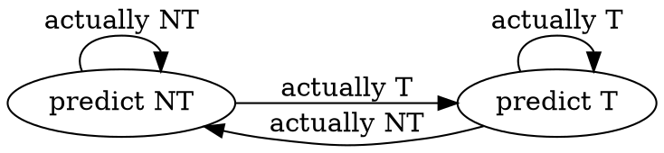
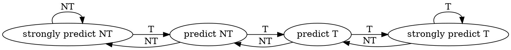

## Question 1
![[Pasted image 20260613190324.png]]

```
g = 0; 
r = 0; 
s = 0; 
some_large_number = 1000000; 

do 
	for (j=0; j<5; j++) { 
		r++; 
	} 
	
	for (k=0; k<7; k++) { 
		s++; 
	} 
	
	g++; 
	
} while (g < some large number)
```

### a) Miss rate
![[Pasted image 20260614134532.png]]

We will count the amount of continuous and non continuous executions that each of the block in the code yields, sum all the continuous ones and divide by the total.


#### First loop 
```
for (j=0; j<5; j++) { 
		r++; 
} 
```

We need to analyze all of the instructions that happen in the loop in runtime :

- j=0 : we initialize the counter of the loop to be 0 in the first iteration only $\implies$ 1 continuous
- j<5 : we check the loop condition on the counter to know if to branch out of the loop. It is non-continuous only on the last iteration (j=5) when the condition is not satisfied $\implies$ 1 continuous, 5 non-continuous
- j++ : we increment the counter each iteration $\implies$ 5 continuous
- r++ : we increment the variable r each iteration $\implies$ 5 continuous
- j top_loop : we jump back to the top of the loop to the condition checking $\implies$ 5 non- continuous

| insturction\iter | 1   | 2   | 3   | 4   | 5   | 6   |
| ---------------- | --- | --- | --- | --- | --- | --- |
| j=0              | ✅   | --- | --- | --- | --- | --- |
| j < 5            | ✅   | ✅   | ✅   | ✅   | ✅   | ❌   |
| j ++             | ✅   | ✅   | ✅   | ✅   | ✅   | --- |
| r++              | ✅   | ✅   | ✅   | ✅   | ✅   | --- |
| j top_loop       | ❌   | ❌   | ❌   | ❌   | ❌   | --- |
overall we got : 
- ✅ 16 continuous instructions 
-  ❌ 6 non-continuous instructions 

#### Second Loop
```
for (k=0; k<7; k++) { 
		s++; 
} 
```

Applying the same logic we applied to the first loop :

| insturction\iter | 1   | 2   | 3   | 4   | 5   | 6   | 7   | 8   |
| ---------------- | --- | --- | --- | --- | --- | --- | --- | --- |
| k=0              | ✅   | --- | --- | --- | --- | --- | --- | --- |
| k < 5            | ✅   | ✅   | ✅   | ✅   | ✅   | ✅   | ✅   | ❌   |
| k ++             | ✅   | ✅   | ✅   | ✅   | ✅   | ✅   | ✅   | --- |
| k++              | ✅   | ✅   | ✅   | ✅   | ✅   | ✅   | ✅   | --- |
| j top_loop       | ❌   | ❌   | ❌   | ❌   | ❌   | ❌   | ❌   | --- |
overall we got : 
- ✅ 22 continuous instructions 
-  ❌ 8 non-continuous instructions 

#### Outer Loop
```
do{ 
	
	{...}
	
	g++; 
	
} while (g < some large number)
```

Every outer loop yields one continuous instruction and one non continuous instruction.

overall we got : 
- ✅ 1 continuous instructions 
-  ❌ 1 non-continuous instructions 

#### Overall Ratio

Taking all previous considerations we get :
$$R_{continuous} = \frac{\text{\#continuous}}{\text{\#total instruction}} = \frac{16(\text{first loop}) + 22 (\text{second loop}) + 1(\text{outer loop})}{22+30+2} = \frac{39}{54} \approx 72.2\%$$

### b) One Bit Predictor
![[Pasted image 20260614160823.png]]



We re-evaluate the code block, this time while using a LTP:
#### First loop 
```
for (j=0; j<5; j++) { 
		r++; 
} 
```

Based on the previous table we made, we know that the sequence of entries for the first loop is :

| iter.      | 1           | 2   | 3   | 4   | 5   | 6   |
| ---------- | ----------- | --- | --- | --- | --- | --- |
| Branching  | T           | T   | T   | T   | T   | NT  |
| Prediction | NT(Default) | T   | T   | T   | T   | T   |
| Result     | ❌           | ✅   | ✅   | ✅   | ✅   | ❌   |
overall we got : 
- ✅ 4 correct predictions  
-  ❌ 2 incorrect predictions

#### Second Loop
```
for (k=0; k<7; k++) { 
		s++; 
} 
```

Applying the same logic we applied to the first loop :

| iter.      | 1   | 2   | 3   | 4   | 5   | 6   | 7   | 8   |
| ---------- | --- | --- | --- | --- | --- | --- | --- | --- |
| Branching  | T   | T   | T   | T   | T   | T   | T   | NT  |
| Prediction | NT  | T   | T   | T   | T   | T   | T   | T   |
| Result     | ❌   | ✅   | ✅   | ✅   | ✅   | ✅   | ✅   | ❌   |
overall we got : 
- ✅ 6 correct predictions  
-  ❌ 2 incorrect predictions
#### Outer Loop
```
do{ 
	
	{...}
	
	g++; 
	
} while (g < some large number)
```

The predictor is initialized to the NT state so the prediction is always NT which is the correct prediction (except for the last iteration of the outer loop that is to be neglected...)

overall we got : 
- ✅ 1 correct prediction

#### LTP Hit Ratio

Taking all previous considerations we get :
$$R_{continuous} = \frac{\text{\#correct}}{\text{\#branchings}} = \frac{4+6+1}{6+8+1} = \frac{11}{15}$$

### c) Two Bit Predictor - Miss Rate
![[Pasted image 20260615132405.png]]



We re-evaluate the code block, this time while using a BMP:
#### First loop 
```
for (j=0; j<5; j++) { 
		r++; 
} 
```

Based on the previous table we made, we know that the sequence of entries for the first loop is :

| iter.      | 1           | 2   | 3   | 4   | 5   | 6   |
| ---------- | ----------- | --- | --- | --- | --- | --- |
| Branching  | T           | T   | T   | T   | T   | NT  |
| state      | ST(Default) | ST  | ST  | ST  | ST  | T   |
| Prediction | T           | T   | T   | T   | T   | T   |
| Result     | ✅           | ✅   | ✅   | ✅   | ✅   | ❌   |
overall we got : 
- ✅ 5 correct predictions  
-  ❌ 1 incorrect predictions

#### Second Loop
```
for (k=0; k<7; k++) { 
		s++; 
} 
```

Applying the same logic we applied to the first loop :

| iter.      | 1           | 2   | 3   | 4   | 5   | 6   | 7   | 8   |
| ---------- | ----------- | --- | --- | --- | --- | --- | --- | --- |
| Branching  | T           | T   | T   | T   | T   | T   | T   | NT  |
| state      | ST(Default) | ST  | ST  | ST  | ST  | ST  | ST  | T   |
| Prediction | T           | T   | T   | T   | T   | T   | T   | T   |
| Result     | ✅           | ✅   | ✅   | ✅   | ✅   | ✅   | ✅   | ❌   |
overall we got : 
- ✅ 7 correct predictions  
-  ❌ 1 incorrect predictions
#### Outer Loop
```
do{ 
	
	{...}
	
	g++; 
	
} while (g < some large number)
```

The predictor is initialized to the ST state so the prediction is T for the entire loop except for the last iteration when the predictor predicts T when in fact it is NT.

overall we got : 
- ✅ 1 correct prediction

#### BMP Hit Ratio

Taking all previous considerations we get :
$$R_{continuous} = \frac{\text{\#correct}}{\text{\#branchings}} = \frac{5+7+1}{6+8+1} = \frac{13}{15}$$

### d) Local Predictor
![[Pasted image 20260615160425.png]]

The assumption that a large enough number of the while loop iterations were finished lets us assume that the Pattern History Table of the predictor is already filled and stabilized.

#### First loop 

| iter.     | 1   | 2   | 3   | 4   | 5   | 6   |
| --------- | --- | --- | --- | --- | --- | --- |
| Branching | T   | T   | T   | T   | T   | NT  |
Since the sequence is repeating for the first loop and it is of length 6, from a discussion in class we concluded that it can be predicted with 100% accuracy using a local predictor with a history buffer of length 5, which fits our case exactly.

overall we got : 
- ✅ 6 correct predictions  $\implies$ 100%

#### Second Loop

| iter.     | 1   | 2   | 3   | 4   | 5   | 6   | 7   | 8   |
| --------- | --- | --- | --- | --- | --- | --- | --- | --- |
| Branching | T   | T   | T   | T   | T   | T   | T   | NT  |
For the second loop the assumption regarding the length of the predictor does not hold so we need to re-evaluate the situation.

For the following entries we can assume that the predictor will converge to the states yielding 100% prediction accuracy since every time those subsequences appear the following branching is always a T : `11110`, `11101`,`11011`,`10111`,`01111`

The only case left to evaluate is the entry of `11111`.
We know that for the second loop the subsequence appears three times :

- iteration 6  $\implies$ T
- iteration 7  $\implies$ T
- iteration 8  $\implies$ NT

We can deduce that the FSM for the entry of `11111` will always be in either the ST state or the T state when both states predict T.

overall we got :
- ✅ 7 correct predictions
- ❌ 1 incorrect prediction

#### Outer Loop

| Iter.     | 1   | 2   | 3   | ... |
| --------- | --- | --- | --- | --- |
| Branching | NT  | NT  | NT  | NT  |

We can see that the while loop branching sequence is a constant sequence of NT and therefore from a certain point, the predictor will always see the subsequence `11111` and predict NT correctly.

overall we got : 
- ✅ 1 correct prediction

#### Local Predictor Hit Ratio

Taking all previous considerations we get :
$$R_{continuous} = \frac{\text{\#correct}}{\text{\#branchings}} = \frac{6+7+1}{6+8+1} = \frac{14}{15}$$

## Question 2
![[Pasted image 20260615172955.png]]
![[Pasted image 20260615173015.png]]

### a) Fill in Table


```
y = [18,13,10,11,12,20,27,30,33];

for y_i in y :
	
	if y%2 == 0 :
		r++;
		
	if y%10 == 0 :
		s++;
```


#### g values

| g   | NT  | NT  | T   | NT  | NT  | T   | NT  | T   | NT  |
| --- | --- | --- | --- | --- | --- | --- | --- | --- | --- |

#### g = 0 :

|                  | 18          | 13  | 10  | 11  | 12  | 20  | 27  | 30  | 33  |
| ---------------- | ----------- | --- | --- | --- | --- | --- | --- | --- | --- |
| b1 actual (y%2)  | T           | NT  |     | NT  | T   |     | NT  |     | NT  |
| b1 pred          | NT(Default) | T   |     | NT  | T   |     | NT  |     | NT  |
| b1 hit/miss      | ❌           | ❌   |     | ✅   | ✅   |     | ✅   |     | ✅   |
|                  |             |     |     |     |     |     |     |     |     |
| b2 actual (y%10) | NT          | NT  |     | NT  | NT  |     | NT  |     | NT  |
| b2 pred          | NT(Default) | NT  |     | NT  | T   |     | NT  |     | NT  |
| b2 hit/miss      | ✅           | ✅   |     | ✅   | ❌   |     | ✅   |     | ✅   |
#### g = 1 :

|                  | 18          | 13  | 10  | 11  | 12  | 20  | 27  | 30  | 33  |
| ---------------- | ----------- | --- | --- | --- | --- | --- | --- | --- | --- |
| b1 actual (y%2)  |             |     | T   |     |     | T   |     | T   |     |
| b1 pred          | NT(Default) |     | NT  |     |     | T   |     | T   |     |
| b1 hit/miss      |             |     | ❌   |     |     | ✅   |     | ✅   |     |
|                  |             |     |     |     |     |     |     |     |     |
| b2 actual (y%10) |             |     | T   |     |     | T   |     | T   |     |
| b2 pred          | NT(Default) |     | NT  |     |     | NT  |     | T   |     |
| b2 hit/miss      |             |     | ❌   |     |     | ❌   |     | ✅   |     |

**A few notes on the tables :**

- The values of a column in each of the tables are filled only if the last prediction in the running of the program was T/NT accordingly.

- The blank spaces represent values that were not calculated since the value of g dictated the program to make predictions based on the other table. Meaning, if a column in the g=0 table was not filled it means that the value of g in that iteration was g=1.

- Default NT values were filled all along for convenience and readability.

#### Table As Requested In Assignment!

> [!success] Final Table
> 
|                  | 18          | 13  | 10  | 11  | 12  | 20  | 27  | 30  | 33  |
| ---------------- | ----------- | --- | --- | --- | --- | --- | --- | --- | --- |
| **g=0**          | ✅           | ✅   | ❌   | ✅   | ✅   | ❌   | ✅   | ❌   | ✅   |
| b1 actual (y%2)  | T           | NT  |     | NT  | T   |     | NT  |     | NT  |
| b1 pred          | NT(Default) | T   |     | NT  | T   |     | NT  |     | NT  |
| b2 actual (y%10) | NT          | NT  |     | NT  | NT  |     | NT  |     | NT  |
| b2 pred          | NT(Default) | NT  |     | NT  | T   |     | NT  |     | NT  |
| **g=1**          | ❌           | ❌   | ✅   | ❌   | ❌   | ✅   | ❌   | ✅   | ❌   |
| b1 actual (y%2)  |             |     | T   |     |     | T   |     | T   |     |
| b1 pred          | NT(Default) |     | NT  |     |     | T   |     | T   |     |
| b2 actual (y%10) |             |     | T   |     |     | T   |     | T   |     |
| b2 pred          | NT(Default) |     | NT  |     |     | NT  |     | T   |     |

### b) Hit Ratio

Over all we get hit rates : 

1. **b1** : 6/9

2. **b2** : 6/9

## Question 3

#### Setup :
![[Pasted image 20260615233435.png]]

#### assumptions :
![[Pasted image 20260615233510.png]]

### a) Calculate CPI
![[Pasted image 20260615233626.png]]

We will calculate the CPI based on the formula given in class :

$$CPI_{average} = CPI_{ideal} + \text{Data stalls} + \text{Control stalls}$$
Data stalls :
- **Load :** 
	Since 25% of the instructions are load instructions and 50% of them are stalled for 6 cycles due to dependency we get : $\text{Load stalls} = 0.25 \cdot 0.5\cdot 6 = 0.75$

Control stalls :
- **Conditioned Branching :** 
	Since 11% of the instructions are Conditioned Branching instructions and 30% of them are mis-predicted and cause a stall of 1 cycle we get : $\text{Conditioned Branching stalls} = 0.11 \cdot 0.30\cdot 1 = 0.033$

- **Unconditioned Branching :** 
	Since 2% of the instructions are Unconditioned Branching instructions and 100% of them cause a stall of 1 cycle we get :
	$\text{Unconditioned Branching stalls} = 0.2 \cdot 1\cdot 1 = 0.02$
	
The rest of the instructions don't have any stalls and are calculated to have ideal CPI...

Overall we get the total average CPI :

$$CPI_{average} = 1 + 0.75 + (0.033 + 0.02) = 1.803_{CPI}$$
### b) CPI for 1e11 instructions 
![[Pasted image 20260616003447.png]]

We will use the average CPI we calculated in the previous subsection and plug it in the formula of the runtime :
$$T = IC \times CPI_{average} \times T_{c}$$
$$\implies T = 10^{11} \times 1.803 \times 400\cdot 10^{-12} = $$
$$\implies T = 72.12_{sec}$$

## Question 4
![[Pasted image 20260616003955.png]]


Hazards are situations that happen during runtime that disrupt the flow of the pipelining and prevent the CPU from achieving the ideal CPI (...=1). They can be categorized as follows:

#### Hazards

1. **Data Hazards** : When the next instruction depend on the output data of previous instructions that might not be calculated yet. For example we can take the following code : 
```
addi R1,R2,5 <-
add  R3,R1,7 <-
```
We can see that the `add` instruction depends on the computed value in `R1` but since the instructions are adjacent, they are 1 cycle away from each other in the pipeline and the first instruction might have not stored the computed value in `R1` yet.


2. **Control Hazard** : When the next instruction depend on the output of a condition that is calculated at that moment so the next instruction that is to be performed is ambiguous.  For example we can take the following code : 
```
beq s2, s3, L1 <-
or s9, t6, s8 

L1: 
and s7, s8, t2
```
We can see that the next instruction that is to be performed depends on the computed condition `s2 == s3` so the CPU can't tell for sure what is the next instruction, the `or` or the `and`.


3. **Structural Hazard** : When the 2 different instructions in the pipeline want to access the same hardware resource.  For example we can take the following code : 
```
lw  t0, 0(a0)  <-
add t1, t2, t3    
sub t4, t5, t6     
or  t7, t8, t9 <-
```
We can see that when the `lw` instruction is in the 4th stage of the pipeline (MEM) the `or` instruction is in the first stage of the pipeline (FETCH) and needs to be fetch from memory.
This means that 2 instructions are trying to access the memory at the same time while the memory can only supply one of them.

#### Handling Methods

1. **Pipelining :**
	


