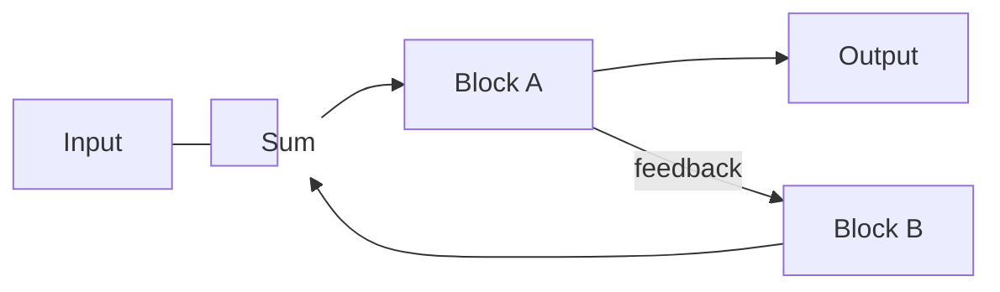

```desmos-graph
left = -5 ; right = 5
top = 3 ; bottom = -3
---
f(x) = \tan^{-1}(x)
y = -\pi / 2 | dashed
y = \pi / 2 | dashed

g(x) = x | blue
```



```mermaid

graph LR
    %% Define the Black and White style
    classDef bw fill:#fff,stroke:#000,color:#000,stroke-width:2px;

    %% Nodes with updated shapes
    Input([Input]):::bw --> Sum("Sum"):::bw
    Sum --> A[Block A]:::bw
    A --> Output([Output]):::bw
    
    %% Feedback path
    %% Using a 'pick-off' node to make the branch look cleaner
    A --- Junction(( )):::bw
    Junction --> B[Block B]:::bw
    B --> Sum

    %% Minimalist style for the junction point
    style Junction fill:#000,stroke:#000,width:8px,height:8px
```



```mermaid
flowchart LR
    
    Input[Input]:::bw --> Sum["Sum"]:::bw
    Sum --> A[Block A]:::bw
    A --> Output[Output]:::bw
    
    A -- feedback --> B[Block B]:::bw
    B --> Sum

    %% Styling specific nodes to be perfectly square
    style Sum width:40px,height:40px
```

