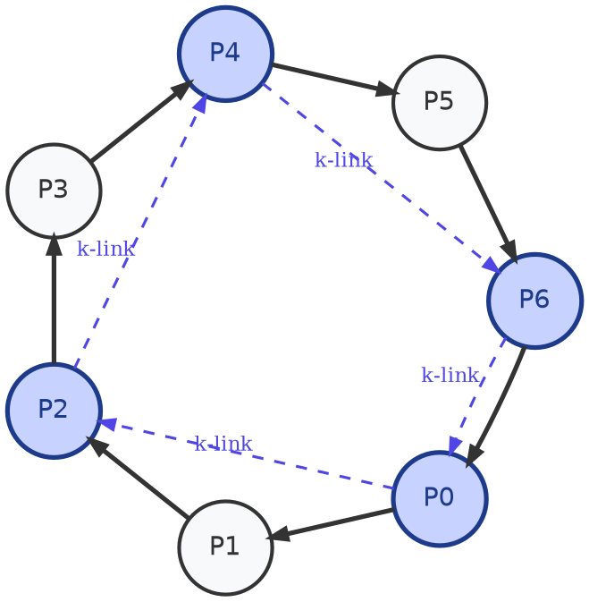

## Question 1 - Cheating The Leader Election Algorithm:
**Given:**
- A network with $n$ processes, each with a unique `ID`.
- A link between any two processes, *unbounded but finite* delay.

**Considered approach:**
1. At the beginning every process sends its `ID` to the rest of the processes.
2. The one that finds out it has the *largest* `ID` proposes itself as the leader.

Suppose now that some process $P$ is a liar - it sends incorrect messages.

>[!success] Solution
>In order for a process to elect itself it needs to have the largest `ID` of the ones it received.
>Therefore, for $p$ to make sure no process elects itself, it has to send an `ID` larger than the largest one in the network.
>In order to achieve that we will use the link property *unbounded and finite* so that $P$ is "eavesdropping" to the network and only upon receiving $n-1$ messages (all other processes) it sends an `ID`$=ID_{max}+1$.
>**link property:** Unbounded and finite.
>**minimum messages:**
>Since every valid process exchanges its `ID` with every other valid process, only the one with the largest `ID` will want to propose itself as the leader, basically doing $Ps$ job for him with all other processes.
>Therefore, $P$ only needs to send a message to the process with `ID`$=ID_{max}$ and thus the minimum number of messages required is $\mathcal{1}$.

---
## Question 2 - Analysis of the $K-Flood-Set$ Algorithm:
**Given:**
- A maximum of $f$ stopping failures.
- Each failed process is guaranteed to successfully deliver its message to at least $k$ other processes.
- We solve for the case $k\le f$.

>[!success] Solution
>We will use the adversary strategy to find the upper bound on the round complexity.
>**Round 1:**
>In the worst case for us (and best for the adversary) there is only $1$ failed process.
>This creates a group of size $K$ that knows the whole network, lets call this group the first generation.
>**Round 2:**
>Here we can divide it into two possible cases:
>- At least one process of the current generation hasn't failed, thus all the network is now synchronized and we are done.
>- All processes in the current generation failed, creating a new generation of size $1\le k \le K^2$
>
>The adversary will choose the worst case for us, which is the second case with generation size $K$.
>**Round 3 $\to \frac{f}{K}$:**
>This means there will be $\frac{f}{K}$  such generations until we can guarantee that there is one non-failed process and that the network is synchronized.
>**Round Complexity:**
>Form what we detailed above, the fist round will take $1$ failure and each consecutive round will take $K$, thus the number of round $r$ is of the formula: $1 + k\cdot (r-1)\le f$

---
## Question 3 - $k-Ring$ Computation:
**Given:**
- Uni-directed ring with $n$ processes.
- The size of the ring is knows to all processes.
- There are links: $P_i \to P_{(i+1)mod\ n}$.
- Each Process $P_i:\ 0\le i\le n$, has a unique `ID` $U_i$.
- Some $k$ processes $P_{j,1},P_{j,2},\dots,P_{j,k}$ (not necessarily consecutive in the ring):
	- form a uni-directed ring: There are links $P_{j,1}\to P_{j,2}$.
	- $P_{j,1}$ is given to be $P_j$ in the original ring.
- The topology of the network is knows to all precesses.
- Each one of the $k$ precesses $P_{j,1},P_{j,2},\dots,P_{j,k}$ needs to compute the maximal `ID` in the network.

**The Goal:**
The goal is to choose the best group $P_{j,1},P_{j,2},\dots,P_{j,k}$ such that the number of rounds in the worst case is minimized for the required computation and for any arbitrary value of $k$.
*How should that group be chosen? Explain.*

>[!success] Solution
>The solution to this problem is a two-phase algorithm:
>- **Phase 1: Gathering**
>	- Each Process $i$ sends its `ID`$-U_i$ to the closest $P_{j,m}$ for some $m:\ 0\le m\le k$.
>	- Let us denote the distances between every consecutive nodes in form the main ring in the small ting, $P_{j,m},P_{j,m+1}$, as $d_m:\ 0\le m\le k$.
>	- Denoting the largest such distance as $D$, we know that the furthest a *regular* node needs to send its `ID` is $D-1$.
>	- Therefore, after $D-1$ rounds we can guarantee that all the processes the $k-ring$ know all $U_i:\ 0\le i\le n$.
>- **Phase 2: Sharing**
>	- Now that all $k$ process in the $k-ring$ know all the unique `IDs` from the big network, we can calculate the maximum by sharing it.
>	- All nodes in the $k-ring$ share the maximum `ID` they saw to all the other $k-1$ processes on the ring.
>	- After such sharing, which takes $k-1$ steps, all precesses in the $k-ring$ will know the maximal `ID` in the network.
>- **Worst-Case Round Complexity:**
>	- The worst scenario is when the process with the maximal `ID` is located at the beginning of the largest distance $D\implies D-1$ rounds.
>	- Then we need $k-1$ rounds to share this value throughout the $k-ring$.
>	- Overall: *Total Rounds* $=D-1 + k-1 = D+k-2$.
>- **Optimizing The Network:**
>	- In order to minimize the worst-case round complexity for an arbitrary $k$, we should look at the formula we just found: $D+k-2$.
>	- Since $k$ is arbitrary we will treat it as a constant and so the optimization will have to be on $D$:
>		- First, we know that the sum of such distances is: $\sum_{m=1}^kd_m=n$
>		- Therefore, in order to make the maximal distance $D$ as small as possible, we should make all distances as close as we can.
>		- This means that the theoretical bound on $D$ is $\lceil \frac{n}{k}\rceil$.
>- **The Final Answer:** As we just showed, the minimum worst-case round complexity for this problem is: $D+k-2 = \lceil \frac{n}{k} \rceil +k -2$.

## Question 4 - Byzantine Agreement In The k-Connected Graph:
**Given:**
- A network with $n$ processes, each with a unique `ID`.
- We have at most $f$ failing processes where $f$ satisfies : $f \lt \frac n3$ 
- The connectivity of the network is given by : $C(G) \ge 2f + 1$
- We assume the correctness of the solution to the Byzantine Agreement problem in a complete network (proven in class...)

**The Goal:**
We are looking for an algorithm that solves the Byzantine Agreement problem for the case of a    k-connected network.

> [!NOTE] Definition
> The connectivity of the network is defined to be the smallest subset of nodes, that if removed, will render the network either disconnected or a single node :
$$C\left(G = (V,E)\right) = \underset{U\subseteq V}{min}\left\{ |U| : G \backslash U - disconnected \right\}$$

### Part a) -  Find The Algorithm

**Considered approach:**
The original algorithm that solves the Byzantine Agreement assumes that the structure of the network is a complete network $K_n$ where there exists an edge between every 2 processes.
Our network is not necessarily connected. We can bridge that gap by taking advantage of assumption 3) :

1. We will construct a robust algorithm for sending a message for our use case.
2. We will construct a robust algorithm for receiving a message for our use case.
3. We will run the Byzantine Agreement solution for the case of a complete network. Every time in the algorithm where we requires sending a message from some process to another, we will use the sending algorithm. This will be an equivalent to sending along a virtual edge between the two processes in a virtual complete network.

#### Auxiliary Algorithms :

**Sending($m,u,v$) :**
- Compute $2f+1$ internally disjoint paths from $u$ to $v$ ($\impliedby$ existence guaranteed from assumption 3 !)
- Send the message $m$ along all of the paths we computed.

**Receiving($v,u$) :**
- process $v$ gathers all messages originating in $u$.
- process $v$ sets $u$'s decision as the majority vote out of all the messages originating in $u$ ( $\impliedby$  must have at least $f+1$ correct messages!)

#### The Algorithm :

- We run the standard Byzantine Agreement algorithm for the case of a complete network with the following exceptions :

	- Every time the algorithm will want to send a message from some process  along an edge in the virtual complete graph that does not exist in the network, it will use the **Sending($m,u,v$)** algorithm instead.

	- Every time the algorithm will expect a message from to be sent from some process $v$ to some other process $u$, it will use the  **Receiving($v,u$)** algorithm instead.

- We will return the the final consensus value returned from the adjusted Byzantine Agreement algorithm.

#### Correctness :

We are given that $f < n/3$, which satisfies the requirements for the Byzantine Agreement problem in a complete network.
Since we are allowed to assume the correctness of said algorithm, all that is left to do is show that the communication between every two processes in the network is reliable. If we can show that, it would mean that the network is equivalent to a complete network connectivity-wise.

**Menger's Theorem** tells us that the vertex connectivity of a graph $C(G)$ and the maximum number of internally vertex-disjoint paths between every pair of nodes in the graph are equal. Meaning, since we are given $C(G) \geq 2f+1$, we can use the theorem to state that there are at least $2f+1$ internally vertex-disjoint paths between every pair of processes in the network.

Because the paths share no internal nodes, a single Byzantine node can corrupt at most one path. Since only $f$ nodes are allowed to fail, at most $f$ of said paths will be compromised, leaving us with at least $f+1$ completely non-faulty paths.

This means that when a message is sent over all paths, at least $f+1$ received messages are the exact, correct message from the sender. Because $f+1$ forms a strict majority of the $2f+1$ paths, when the receiver takes the majority vote, it will always yield the correct value.

$\implies$ Therefore, using the **Sending** and **Receiving** functions guarantees non-faulty communication, allowing the underlying complete-network algorithm to succeed.

#### Complexity Analysis :

- **Communication/Message Complexity:** 
	Let $M$ be the number of messages sent in the standard algorithm on a clique. In our algorithm, every single message is sent over $2f + 1$ paths. The maximum length of any path is $O(n)$. Therefore, the message complexity is multiplied by a factor of $O(f \cdot n)$. If the original  algorithm in a complete network sends $O(n^2)$ messages, the new complexity is $O(f \cdot n^3)$.

- **Time/Round Complexity:**    
    In a standard fully connected BFT algorithm, a message takes 1 round to arrive. In our algorithm, a message must traverse a path of up to length $O(n)$. Therefore, each communication round of the underlying algorithm now takes $O(n)$ synchronous network rounds to complete. If the original algorithm in a complete network takes $f + 1$ rounds, the new time complexity is $O(n \cdot f)$ rounds.

- **Computational Complexity:**    
	Finding the $2f + 1$ disjoint paths requires solving a maximum flow problem between every pair of communicating nodes, which operates in polynomial time. If we want to think of the very worst case for this problem we can assume that $f = \lfloor\frac n3 - 1 \rfloor = O(n)$ meaning that the faulty processes are at there maximum and we can assume that the graph is near complete so $|E| = {|V|\choose 2} = O(n^2)$. For this worst case we can assume that a max-flow solution like the **Ford-Fulkerson Algorithm** will take $O(f \cdot |E|) = O(n^3)$ time complexity to calculate the paths between each pair of processes. Since There are $O(n^2)$ edges in the network, the total worst case runtime is  $O(n^2)\cdot O(n^3) = O(n^5)$. More assumptions on the networks structure might give us a tighter bound...
 
### Part b) - 
