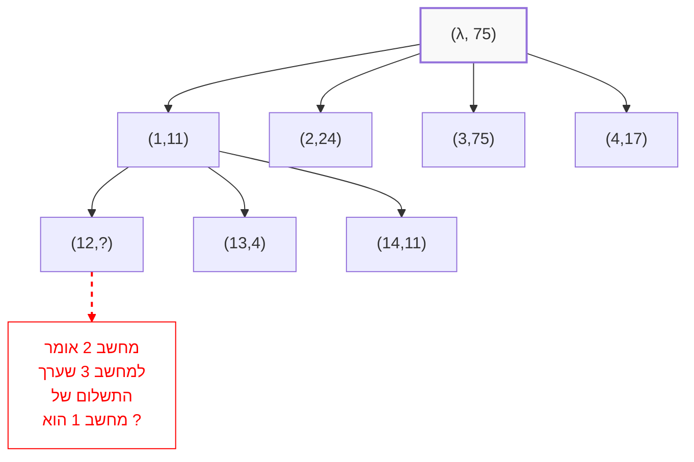

continuing from  [[school/Distributed Algorithms/lectures/lecture 4|lecture 4]]

#### The Coordinated Attack Problem

- Let there be a network $G = (V,E) , \omega : E \to \mathbb{R}$
- Each process has some input value
- We will assume the number of failing processes are less than a third of the processes : $f \lt \frac{n}{3}$

All non failing processes must agree on the same output value under the following conditions :
1. agreement
2. assertiveness - if all failing processes start with the same value $v$ then they must decide $v$
3. finalize - whom ever does not fail must decide on some value 

#### Building the _ELG_ tree

For this method of solution we assume that we know the number of failing computers $f$.
Each process builds a _ELG_ tree for himself this way:

- The root is  a default tag and the initial value of process $i$ 
- Each child is prefixed by the tag of the father and followed by on of the tags that were yet to be used. 
- The value of the child node is the value the value that the predecessor of declared to the child
- for example : $(31,y)$ - meaning that process 1 declared to computer i that is building the tree that the initial value that process 3 declared is $y$.
- We build the tree by iterating the previous stage for f+1 times
- In each stage the message complexity is $\mathcal{O}(n^2)$ for a total of $\mathcal{O}((f+1)n^2)$ for the entire algorithm.

after every process has built a tree, each does the following steps :
- if in some node in the tree there is no value then we set it to be $v_0$ some predetermined default...
- You traverse from the leaf nodes upward and calculate `newval` based on the rule : $$newval(v) = val(v) $$ as long as **$v$ is a leaf node**.
- And if v is an internal node than then $newval(v)$ is set to be the majority of its children's value. if there is no majority then it is decided as $newval(\lambda)$ 

**claim 1**
After f+1 iterations the following happens :
if $i,j,k$ are indices of processes that do not fail and $x$ is a tag that ends with $k$ than : $$val_j(x) = val_i(x)$$ **claim 2**
After f+1 iterations the following happens :
There will be a tag $x$ that ends with an index of a process that does not fail.
Therefore : $$newval_i(x) = val_i(x)$$
in an _ELG_ tree of a process that does not fail.

**claim 3** 
if all processes that do not fail start with the same value v, then that value will be decided on in the final iteration of the algorithm.

**proof:**
- Assuming that all processes start with the same value $v$ then already in the first stage of the algorithm they will broadcast that value.
- Therefore $val_i(f) = v$ for all processes that do not fail.
- From claim 2 we will get that $newval_i(j) = v$
- therefore by the majority rule $newval_i(\lambda) = v : \forall i \not\in F$ 

**definition** 
we will name a subset $C$ of processes of a tree a _Path Cover_ 
if every path in that tree, from the root to a leaf node contains at least one node from $C$

**definition** 
A node with a tag $x$ in a _ELG_ tree is called a _joint node_ if for every node $i \not\in F$ there are identical values of $newval(x)$ 
we know that such a node must appear as a a path in a tree with a tag that ends with a non-failing process (since it broadcasts the same value it got to all other processes indifferently...)

**claim 4**
After $f+1$ stages there must exist a common path in all _ELG_ trees.

**proof:**
There must exist a a set of nodes with the same value in all _ELG_ trees.
We will take the nodes of the form $[y...,l]$ where l is an index of a process that does not fail.
Since there are $f$ failing processes, one of them is a non-failing process.

**claim 5**
Let there be $x$ a node of some sort in an _ELG_ tree. If there is a _Path Cover_ of subtrees with $x$ as a root then $x$ is a _Common Node_.

Using **claim 4** we can deduce that :
There is a common root for all _ELG_ trees $\implies$ agreement condition is satisfied!

**proof:**
If $x$ is a leaf then the _Path Cover_ is $x$ itself and therefore $x$ is common.
Assuming $|x| = v , 0 \le r \le f$,
Assuming that there is a common _Path Cover_ $C$ of subtrees of $x$.

We examine some child node $xl$ of $x$.
since $x \not\in C$ , $C$ is a _Path Cover_ for a sub tree with root $xl$ Therefore, by I.H. $xl$ is common. 
Since we chose $xl$ randomly all children of $x$ are common.
Therefore by definition of $newval(x)$, $x$ is common.

## Binary Byzanthine Agreement

The agreement problem with _Byzanthine Failures_ when the inputs are $\{0,1\}$
We will denote by _BBAA_ the algorithm that solves the problem
we will use a reduction from BBAA to `Turpin-Coan` general algorithm.

#### Turpin-Coan Algorithm
 Every  Process will store 4 variables : $x,y,z,vote$ 
$x$ is an initial input and y$,z,vote$ are initialized randomly
1. Process $i$ sends $x$ to all nodes if from all received messages there is at least one $n-f$ with the same value $v$ then the process sets $y=v$, else $y=Null$
2. Process $i$ broadcasts $y$ 
	- if from the messages there are at least $n-f$ messages with the same value then $i$ sets $vote=1$, else $vote=0$. 
	- Process $i$ sets $z$ the majority vote.
	- if all votes are $Null$, z is undefined
3. We run BBAA while using the votes as inputs. If process $i$ decides 1 and $z$ is defined then the final answer is $z$, else the answer is $v_0$.

**Observation**
There are at most one value $v$ that is sent by non-failing processes.

Assuming by contradiction that 2 values are sent : $v,w$
Process $i$ broadcasts $w$, meaning that in the first stages $i$ received at least $n-f$ messages of value $v$ and therefore in the first stage $i$ received at least $n-2f$ messages that were not sent by failing processes.

Process $j$ broadcasts $w$, on the other hand since $j$ broadcasts $w$ in stage 2. That means that $j$ received at least $n-f$ messages with w in the first stage.

We notice that in the first stage :
- $j$ received $n-f$ messages with $w$
- $j$ received $n-2f$ messages with $v$
$\implies 2n-3f \le n$ messages (must exist...)
$\implies 3f \le n \implies f \le \frac{n}{3}$

#### Agreement
We will prove that the Agreement condition is satisfied.

If BBAA returns 0 then all processes decide on $v_0$ and agree.

- Assuming that BBAA returns 1.
- Since BBAA returned 1, that means that there must be a process $i$ that its input is $vote_i = 1$.
- That means that $i$ got at least $n-f$ messages with some value $v$ in stage 2.
- Since there are $f$ failing processes, that means that $i$ got at least $n-2f$ messages in stage 2 that contain $v$ from non- failing processes.
- According to previous observation $v$ must b identical to all non-failing processes that sent it in the second stage.
- process $j$ does not receive more than $f$ with values different $v$ and therefore value $v$ is the majority value for each non-failing process $j$ in the end of stage 2 and therefore $j$ decides $z=v$.

