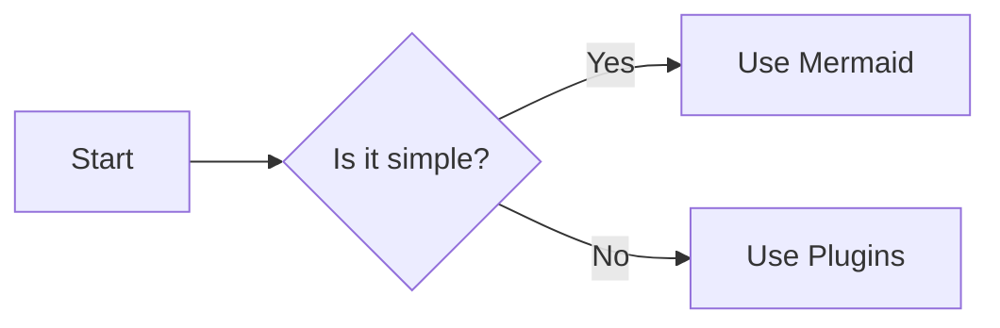

## algorithm for choosing leader in tree

Given network in an undirected tree $T = (V,E) ,\omega:E\longrightarrow\mathbb{R}$

- each computer has a unique ID and the connections are bidirectional
- we want to choose a leader by "breaking the symmetry" meaning differentiating between all computers.

### the algorithm
- **step 1** we with the leaves, if a computer has only one neighbor they forward that to their neighbor.
- **step 2** after all the messages are sent, the computers remove the neighbors that has sent a message.
- we go over the first step again and again until no computers are left.
- **step3** the one that got messages from all of its neighbors can surely know that he is the one who was the last computer and is decided to be the leader
- after that the leader informs the other computers that he is the leader and sends a special message invoking a BFS algorithm.
-
### time complexity
- number of messages : $\mathcal{O}(|V| = N)$
- number of iterations : $\mathcal{O}(\varepsilon(T))$ - the circumference of the tree

### BFS
- when running BFS we can either include or exclude the weights in the graph. 
- we set the hierarchy using parents p(v).
- 
### time complexity
- number of messages : $\mathcal{O}(|V| = N)$
- number of iterations : $\mathcal{O}(\varepsilon(T))$ - the circumference of the tree
- running BFS : $\mathcal{O}(|V|)$ - it is a tree

