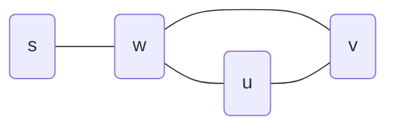

### Exercise 1 : 

Describe an algorithm for determining if a Graph is Bi-partite using the BFS algorithm.

**solution** : the following algorithm solves this 

Is_Bi_partite(G) :
- IBP = True
- pick any $s \in V$ 
- run BFS(G)
- for $uv \in E$ :
	- if (d(s,u) == d(s,u)):
		- IBP = False

**correctness** : 
if :$IsBipartite(G) = False \implies \exists uv \in E : k = d(s,u) = d(s,v)$
- We shall observe $T$ the shortest distances tree from the starting node $s$ .
- We denote with $w$ the lowest common predecessor of $u$ and $v$ (furthest from $s$ in the tree).

$\forall uv \in E : d(s,u) \ne d(s,u)$
We will construct the set $A$ and $B$ that contain all nodes with even and odd distances from $s$ accordingly.
From BFS we get : $$|d(s,u)-d(s,u)| \le 1$$
If we combine both statements we get : $$|d(s,u)-d(s,u)| = 1$$
$\implies \nexists uv \in E : u,v\in A$
and the same goes for $B$.

### Exercise 2 : 

prove the following lemma:
$G - DAG \implies \exists v \in V : d_{in}(v) = 0$

**Proof** :
1. init. - i=0
2. choose a random node $v_0 \in V$
3. if $d_{in}(v_0) = 0 \implies$ finished!
4. 

### Exercise 3 : 

Prove that a graph $G$ is a DAG iff it has a topological sort.

**Proof** : by induction

- Base : 
	graph with 2 nodes (already topologically sorted)

- Hypothesis :
	Assume that for any graph with $n-1$ node has a topological sort.

- Step:
	We will prove for $|V| = n$ 
	From previous exercise we know that there exist a node $v_0 \in V : d_{in}(v_0) = 0$
	We denote $G' = G / \{v\}$  with $n-1$ nodes
	- $\to$ :
		I.H. $G$ has a topological sort since $d_{in}(v_0) = 0 \implies \tilde{G} = \tilde{G'} \bigcup \{v_0\}$ is a legal topological sort.
	- $\gets$ : 
		we will assume by contradiction that there exist a cycle $C : v_i {\to}^P v_{i+k} \to v_i$ 
		for some path $P$. 
		Meaning that $\exists v_{i+k}v_i \in E \implies$ **contradiction** to the fact that all edges in the graph are in the same direction.

Proven by contradiction.

### Topological sort

**Algorithm:** DFS_Recursive(Graph, node, visited)
1.  **Mark** node as visited
2.  **For each** neighbor in Graph.neighbors(node):
3.      **If** neighbor is not visited:
4.          DFS_Recursive(Graph, neighbor, visited)
